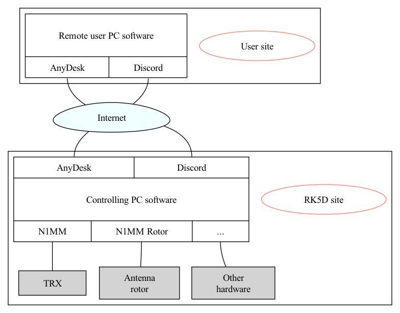
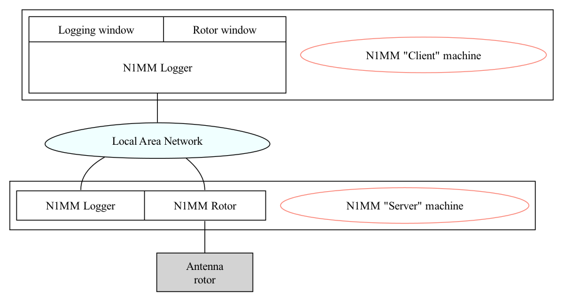

# RK5D remote control configuration

## 0. Let me in
1. Install [AnyDesk](https://anydesk.com) and [Discord](https://discord.com/)
2. Register in Discord
3. Ask me for setting up your access
4. Please read this doc carefully to be aware of usage procedures, limitations and **your** responsibilities

## 1. Starting the station
We have three working places:
- [TS590 controlled by a Microham](./kenwood-via-microham/README.md) - planned for WARC bands
- [TS590](./kenwood-plain/README.md)
- [K3](./elecraft/README.md)

Common things are discussed later in this doc. However working places setup is a bit different so please read through the corresponding manual.

## 2. Controlling the station: common
So you're in and from now on you're controlling the station. Please do not forget that all the hardware depends on your actions.
1. **USE TUNER**: Starting on a new band, please toggle the tuner - using the TUNE button. If the SWR is ok and you can work - you'll hear the "A" CW message. Otherwise you'll hear "SWR" - that means something is wrong.
2. **ANTENNA SWITCHING**: Antennas are switched automatically when you change the band, however there are some important notes:
    - Only 40m, 20m, 15m, 10m are now ready for use with full power (100w).
      Transmitting on 80m makes some RFIs in the shack - which cause the CAT control failure - right in the middle of the transmission, so the transceiver will end up in transmitting state and key down with full power.
      This can now be fixed only offline by turning off the transceiver and restarting the controlling PC, and if there's nobody around - it will cause transceiver extensive heating and PA damage. Transmitting QRP on 80m is ok.
      The same happens if you transmit into an untunned 40m antenna.
3. **ROTATOR**: Never let the antenna cross 0º direction (North). Otherwise the feeding cables might be broken, so please be very careful here.
   If you're say at 330º and want to rotate the antenna to 45º, first toggle rotation to 180º, then continue to 45º.
   The rotator always starts the rotation via the shortest (<180 degrees) path within its full 450 degrees range - but that's more than we want.
##### Once you're done - please return the antenna to 270º
4. **TRANSCEIVER CONTROL**: Control transceiver functions using the buttons configured in the N1MM bandmap window.
   The buttons are different for each transceiver.
    - Pay special attention to RIT and XIT indicators below the transceiver frequency. Once they're toggled - they're red.
    - Unfortunately we don't have indicators for most of the functions controlled by these buttons.
    - For now - just listen the the transceiver beeps when you click the buttons.
    - All buttons within the grid is something we **can** customize so please don't be shy to provide your feedback - if you lack some button there or find something unneeded.
5. **N1MM+ FAQ**:
    - There is a [GREAT manual](https://n1mmwp.hamdocs.com/), split by sections, don't be shy to read it.
    - Read about the **ESM (Enter Sends Message)** mode, it will clarify the most of questions on why and what the log sends when you click some buttons and why and which buttons are yellow: [ESM Mode](https://n1mmwp.hamdocs.com/setup/keyboard-shortcuts/#enter-sends-message-mode-esm)
    - **Ctrl+K** combination toggles CW free text send window, don't be afraid of using it. I bet you type much more faster than the CW speed you use. **Esc** closes it.
    - **Esc** halts sending at any moment
   
## 3. Software responsibilities
The common principle in our setup is that all the controlling software is kept at the controlling PC. 
"Controlling" software refers to logger, antenna rotor control, any other software which **controls** station hardware.
User PC just connects to the controlling PC via **AnyDesk** - for remote desktop control and **Discord** - for two-way sound transmission over the Internet.

Current setup (namely an optical connection at the controlling - i.e. shack - side, and a GPON + WiFi at the client side) provide an acceptable connection speed for usage in both CW and SSB.
A remote microphone (at user's side) is used for SSB, but no remote CW paddle can be used in current setup - so we use either macros or just type CW from the keyboard.

Further details are unique to each working place, see detailed per-working-place docs.

## 4. Hardware connections
Detailed connection diagrams are unique to each working place - see corresponding docs.

But have just one antenna rotator - which is obviously connected just to one controlling PC.
However it can be controlled from any other machine via the N1MM Logger.

