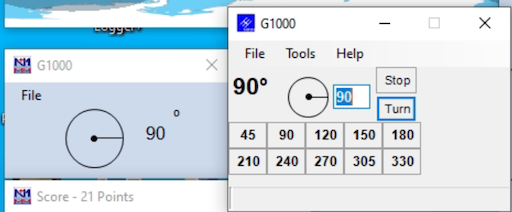

# RK5D remote control configuration

## 0. Let me in
1. Install [AnyDesk](https://anydesk.com)
2. Ask me for setting up your access
3. Please read this doc - just for the sake of an overview - and being aware of limitations and **your** responsibilities
   
## 1. Starting the station:
1. Start the hardware: for now it's done by Dima manually (Controlling PC, 12V PS, G1000, Microham interface, RU005a band decoder)
2. Connect to the controlling PC in AnyDesk
3. Start the software (there are icons on the Desktop, adding paths just FYI):
- **Microham USB Device Router** (*C:\Program Files (x86)\microHAM\bin\urouter.exe*)
- **N1MM+ Logger** (*C:\Program Files (x86)\N1MM Logger+\N1MMLogger.net.exe*)
- **N1MM Rotor** will be started with the logger automatically
4. Start the transceiver by clicking the **ON** button in N1MM's bandmap window

If everything is ok, you should
- See the transceiver frequency in the bandmap window
- See the current antenna position in the rotor window
- Hear the band noise

Congrats You're ready! Please don't give up and read the next section carefully in order not to harm the station.

## 2. Controlling the station
So you're in and from now on you're controlling the station. Please do not forget that all the hardware depends on your actions.
1. **USE TUNER**: Starting on a new band, please toggle the tuner - using the TUNE button. If the SWR is ok and you can work - you'll hear the "A" CW message. Otherwise you'll hear "SWR" - that means something is wrong.
2. **ANTENNA SWITCHING**: Antennas are switched automatically when you change the band, however there are some important notes:
    - Only 40m, 20m, 15m, 10m are now ready for use with full power (100w). 
  Transmitting on 80m makes some RFIs in the shack - which cause the CAT control failure - right in the middle of the transmission, so the transceiver will end up in transmitting state and key down with full power. 
  This can now be fixed only offline by turning off the transceiver and restarting the controlling PC, and if there's nobody around - it will cause transceiver extensive heating and PA damage. Transmitting QRP on 80m is ok.
  The same happens if you transmit into an untunned 40m antenna.
    - There is a problem with LPT port control - unsolved for now - there looks to be some port initialization delay or power saving in Windows.
  See notes below if you face something similar: 
      - Antennas are not switched with the band change (you can't hear the band noise)
      - Antenna is switched - so that you hear the band noise for a few seconds - and then gets disconnected right away
3. **ROTATOR**: Never let the antenna cross 0º direction (North). Otherwise the feeding cables might be broken, so please be very careful here.
If you're say at 330º and want to rotate the antenna to 45º, first toggle rotation to 180º, then continue to 45º.
The rotator always starts the rotation via the shortest (<180 degrees) path within its full 450 degrees range - but that's more than we want.
##### Once you're done - please return the antenna to 270º
4. **TRANSCEIVER CONTROL**: Control transceiver functions using the buttons configured in the N1MM bandmap window.
    - Pay special attention to RIT and XIT indicators below the transceiver frequency. Once they're toggled - they're red.
    - Unfortunately we don't have indicators for most of the functions controlled by these buttons, but we're planning to install a camera in front of the transceiver to see the display.
    - For now - just listen the the transceiver beeps when you click the buttons - the beep frequency is high when a function is enabled and low when a function is disabled. Try it and you'll understand.
    - All buttons within the grid is something we **can** customize so please don't be shy to provide your feedback - if you lack some button there or find something unneeded.
5. **N1MM+ FAQ**:
    - There is a [GREAT manual](https://n1mmwp.hamdocs.com/), split by sections, don't be shy to read it.
    - Read about the **ESM (Enter Sends Message)** mode, it will clarify the most of questions on why and what the log sends when you click some buttons: [ESM Mode](https://n1mmwp.hamdocs.com/setup/keyboard-shortcuts/#enter-sends-message-mode-esm)
    - **Ctrl+K** combination toggles CW free text send window, don't be afraid of using it. I bet you type much more faster than the CW speed you use. **Esc** closes it.
    - **Esc** halts sending at any moment
    
**LPT port and antenna switching hack:**
Just continue switching bands periodically - say each 5 seconds - for a while - 10 swithes should be enough - until it stops disconnecting the antenna after the band change.
If that does not help, try restarting the band decoder (offline action is required for now).

## 3. Software responsibilities

### Overview
Remote user connects to the controlling PC via free AnyDesk software - which provides full remote desktop control and sound streaming. Sound quality may be question for improvement, however current setup (namely an optical connection at the controlling - i.e. shack - side, and a GPON + WiFi at the client side) normally provide an acceptable connection speed for usage in both CW and SSB, given recorded messages are played back at the controlled PC for SSB. There was no need for connecting a remote microphone for us, however that's a point for further investigation.

Using the remote desktop approach instead of configuring each piece of software for network access provides more flexibility - as all the controlling software is used local mode, no limitations caused by usage over network are applied and all the network configuration changes - if any - have to be applied just to AnyDesk configuration rather than to all software as it would have been should we configure each application for remote usage individually. Moreover, any software not supporting network control may be used.

## 4. Hardware connections
More detailed connections diagram 

