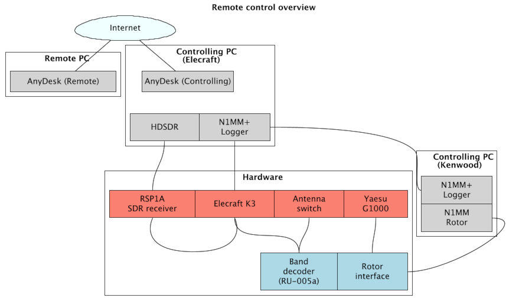
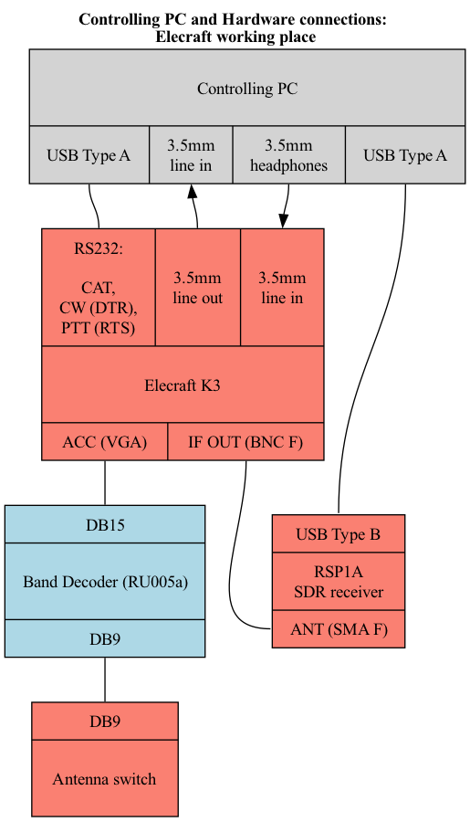

# RK5D remote control configuration (Elecraft)

## 1. Starting the station:
1. Start the hardware: for now it's done by Dima manually (Both (!) Controlling PCs, 12V PS, G1000, RU005a band decoder)
*TODO https://n1mmwp.hamdocs.com/setup/interfacing/#sending-rotor-position-information-to-n1mm-logger*
*TODO https://n1mmwp.hamdocs.com/setup/interfacing/#n1mm-rotor-running-on-another-computer*
2. Connect to the Kenwood controlling PC in AnyDesk
3. Start **N1MM rotor** software (*TODO PATH*)
3. Connect to the Elecraft controlling PC in AnyDesk
4. Start the software (there are icons on the Desktop, adding path just FYI):
- **N1MM+ Logger** (*C:\Program Files (x86)\N1MM Logger+\N1MMLogger.net.exe*)
5. Start the transceiver by clicking the **ON** button in N1MM's bandmap window. Before clicking the "ON" button, click the large red "Reset radio" button if it is present.

If everything is ok, you should
- See the transceiver frequency in the bandmap window
- See the current antenna position in the rotor window
- Hear the band noise

*TODO new bandmap window *
*TODO new rotor window *

Congrats You're ready! Please don't give up and read the next section carefully in order not to harm the station.

## 2. Controlling the station: elecraft
Common things are described in the [base manual](../README.md).

## 3. Software responsibilities: elecraft

### Overview
Remote user connects to the controlling PC via free AnyDesk software - which provides full remote desktop control and sound streaming.
As of now, the rotor is connected to the Kenwood controlling PC - and wired to the Elecraft controlling PC by the means of N1MM network rotor control.
So the Kenwood PC is now also required for full hardware control when using the Elecraft working place - just to start the rotor software (rotation itself can be done via the Elecrafts N1MM).
Sound quality may be question for improvement, however current setup (namely an optical connection at the controlling - i.e. shack - side, 
and a GPON + WiFi at the client side) normally provide an acceptable connection speed for usage in both CW and SSB, 
given recorded messages are played back at the controlled PC for SSB.
There was no need for connecting a remote microphone for us, however that's a point for further investigation.

**TODO test audio with Elecraft, including a remote mic - TBA**

## 4. Hardware connections: elecraft
More detailed connections diagram

