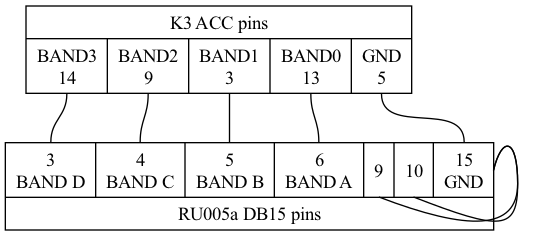

# RK5D remote control configuration (Elecraft)

## Wiring diagram

### PC to Elecraft:
- USB Type A to RS232 adapter cable #TODO test and update
- 2pcs 3.5-to-3.5 stereo cables for audio lines

### PC to RSP1A:
- USB Type A to USD Type B cable

### Elecraft to RU005a:

- VGA socket (15 pin) to DB15, pinout:

Shorts between pins 9,10,15 define RU005a "Band data" mode

### Elecraft to RSP1A:
- BNC male to SMA male cable: connected to IF OUT on K3 rear panel and ANT on RSP