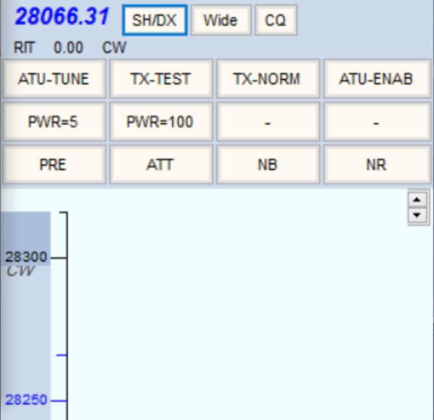
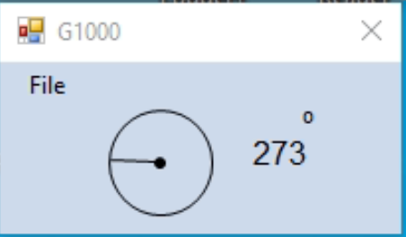
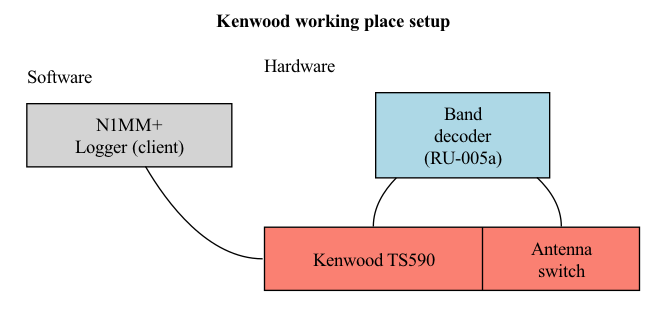
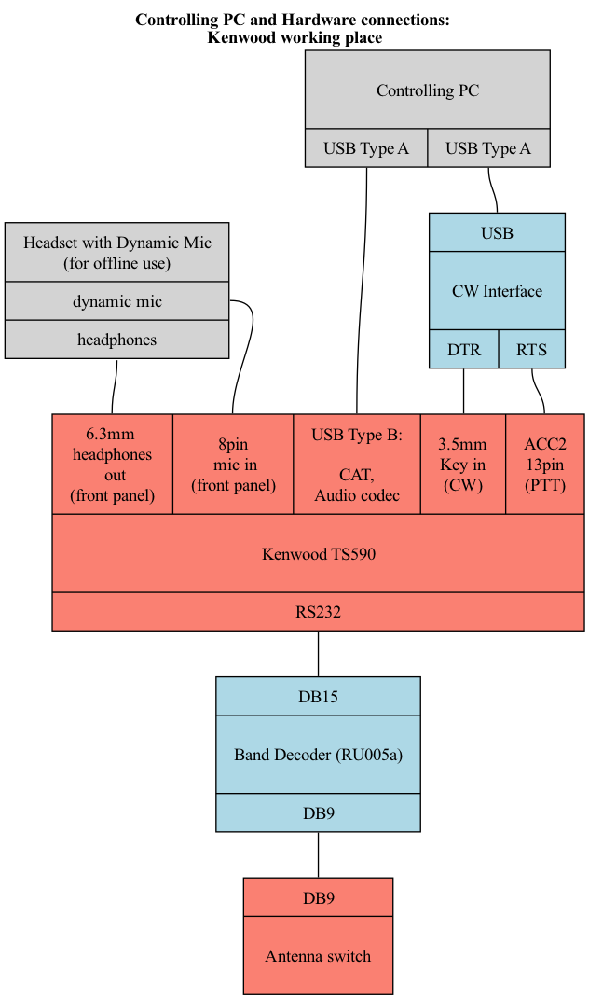

# RK5D remote control (Kenwood working place)

## 1. Starting the station:
1. Start the hardware: for now it's done by Dima manually:
- Server (Kenwood-Microham) Controlling PC
- Kenwood Controlling PC
- 12v PS
- RU005-Kenwood
- G1000
2. Connect to the Server (Kenwood-Microham) controlling PC in AnyDesk
3. Start **N1MM rotor** and **N1MM Log** software
4. Connect to the Kenwood controlling PC in AnyDesk
5. Start the software (there are icons on the Desktop, adding path just FYI):
- **N1MM+ Logger** (*C:\Program Files (x86)\N1MM Logger+\N1MMLogger.net.exe*)
- **Discord**
6. Start the transceiver by clicking the **ON** button in N1MM's bandmap window. Before clicking the "ON" button, click the large red "Reset radio" button if it is present.
7. Enter RK5D Discord Server and ```Kenwood``` channel in Discord

If everything is ok, you should
- See the transceiver frequency in the bandmap window
- See the current antenna position in the rotor window
- Hear the band noise

*Kenwood bandmap window (other buttons are possible)*




*N1MM rotor window*



Congrats You're ready! Please don't give up and read the next section carefully in order not to harm the station.

## 2. Controlling the station: Kenwood
Nothing special for this setup. Common things are described in the [base manual](../README.md).

## 3. Software responsibilities: Kenwood


G1000's rotor is controlled by N1MM Logger via the Server (Kenwood-Microham) PC, the rest should be clear from the diagram.

## 4. Hardware connections: Kenwood


## 5. Detailed setup
See [SETUP.md](SETUP.md)