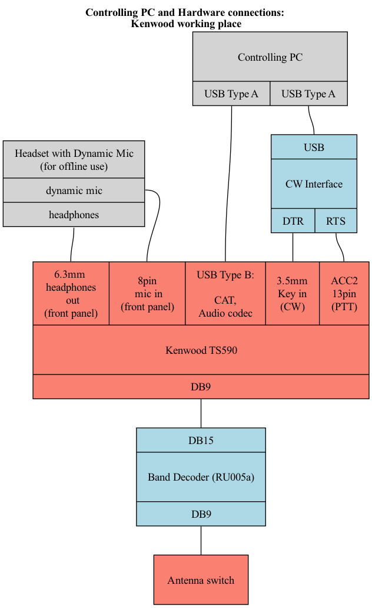
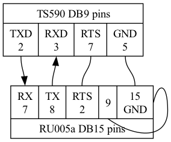

# RK5D remote control configuration (Kenwood)

## Wiring diagram

### PC to Kenwood:
- USB Type A to USB Type B cable (for CAT and Audio)
- CW/PTT interface cable, see below

#### CW/PTT interface cable
- Based USB-to-RS232 adapter

####Pinout:
- PC Side RS232:
- - Pin 4 - to DTR on schematics above
- - Pin 5 - to SG on schematics above
- - Pin 7 (PC side!) - to RTS on schematics above
- Transceiver side CW (3.5mm jack):
- - Sleeve: GND from schematics above
- - Tip: KEY-IN from schematics above
- Transceiver side PTT (ACC2 DB13):
- - Pin 8: GND from schematics above
- - Pin 9: PTT from schematics above
    
####Referenced connectors pinout

**3.5mm**

**ACC2 (as viewed from Transceiver's rear panel)**

Notes from TS590 manual regarding PTT/Audio control:
- When (pin 9) on the ACC2 socket is shorted: Microphone audio input mutes when transmitting
- When (pin 13 = same as the PTT on the front panel mic's connector) on the ACC2 socket is shorted: During transmission, the audio input of ACC2 connector I terminal 11 (ANI) and the USB terminal are muted

### Kenwood to RU005a:

Shorts between pins 9 and 15 define RU005a "Kenwood" mode.
This mode is identified by 4th LED flashing once on RO005a startup. 