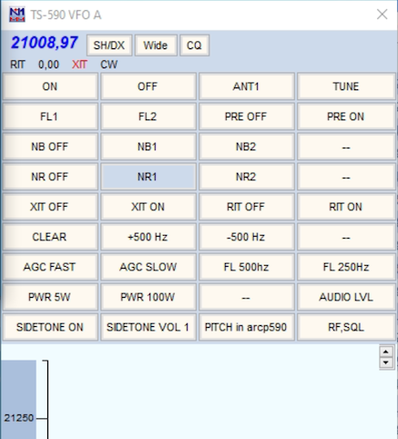
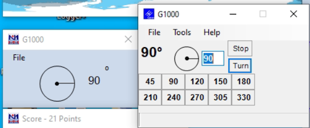
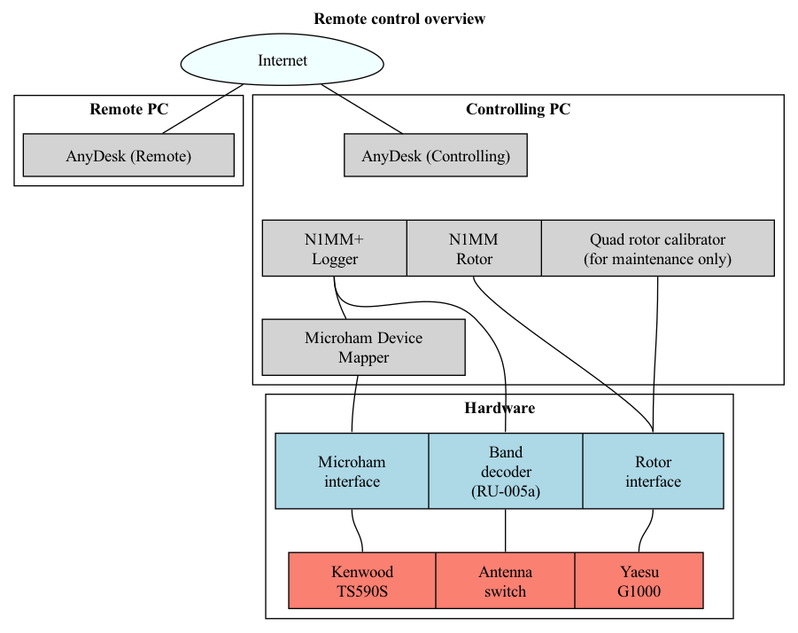
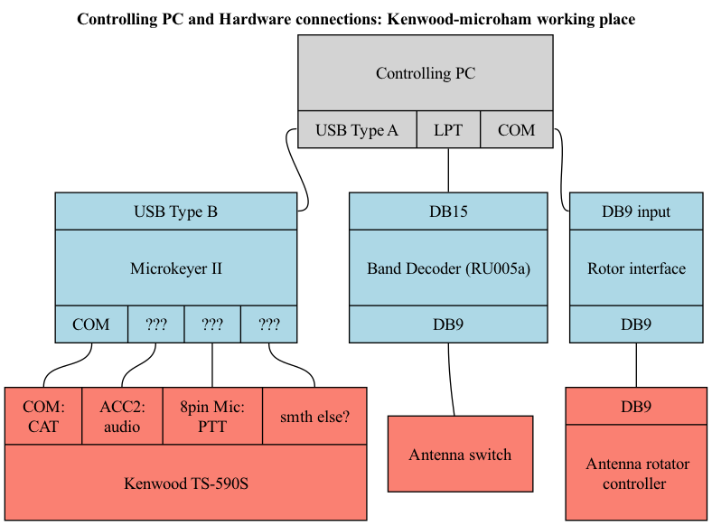

# RK5D remote control (Kenwood-Microham working place)
   
## 1. Starting the station: kenwood-microham
1. Start the hardware: for now it's done by Dima manually (Controlling PC, 12V PS, G1000, Microham interface, RU005a band decoder)
2. Connect to the controlling PC in AnyDesk
3. Start the software (there are icons on the Desktop, adding paths just FYI):
- **Microham USB Device Router** (*C:\Program Files (x86)\microHAM\bin\urouter.exe*)
- **N1MM+ Logger** (*C:\Program Files (x86)\N1MM Logger+\N1MMLogger.net.exe*)
- **N1MM Rotor** will be started with the logger automatically
- **Discord**
4. Start the transceiver by clicking the **ON** button in N1MM's bandmap window. Before clicking the "ON" button, click the large red "Reset radio" button if it is present.
5. Enter RK5D Discord Server and ```Kenwood-microham``` chat in Discord

If everything is ok, you should
- See the transceiver frequency in the bandmap window
- See the current antenna position in the rotor window
- Hear the band noise





Congrats You're ready! Please don't give up and read the following sections carefully in order not to harm the station.

## 2. Controlling the station: kenwood-microham
**ANTENNA SWITCHING**: Antennas are switched automatically when you change the band, however there are some important notes:
- At this working place RU005a band decoder is controlled from PC's LPT port. There is one problem - unsolved for now - there looks to be some port initialization delay or power saving in Windows.
If you face something similar, please use the hack described below: 
    - Antennas are not switched with the band change (you can't hear the band noise)
    - Antenna is switched - so that you hear the band noise for a few seconds - and then gets disconnected right away
    
**LPT port and antenna switching hack:**
Just continue switching bands periodically - say each 5 seconds - for a while - 10 swithes should be enough - until it stops disconnecting the antenna after the band change.
If that does not help, try restarting the band decoder (offline action is required for now).

Common things are described in the [base manual](../README.md).

## 3. Software responsibilities: kenwood-microham


Since Microham is used at this place, additional "Microham device mapper" software has to be used.
It brings unneccessary complexity to the setup bringing no advantages compared to direct com/usb/audio transceiver connection, but we agreed to keep this place as is for now.

## 4. Hardware connections: kenwood-microham
More detailed connections diagram 



## 5. Detailed setup
See [SETUP.md](SETUP.md)