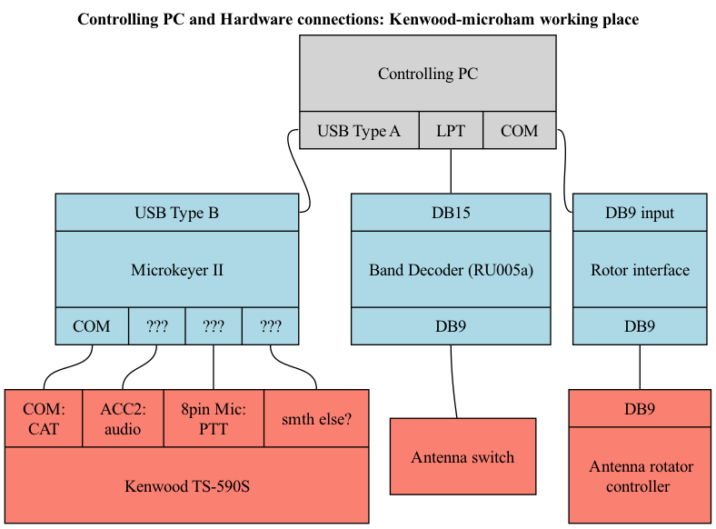

# RK5D remote control configuration (Kenwood via Microham)

## Wiring diagram
Some details are missing here.

This place is going to be reconfigured for use with WARC bands only - hence external antenna switch will not be used. RU005 will also be removed from this working place.

### PC and RU005a:
- LPT to DB15 cable, pinout:

Shorts between pins 9,10,15 define RU005a "Band data" mode
This mode is identified by 2nd LED flashing once on RU005a startup.

Pins 18-25 on the LPT side are shorted