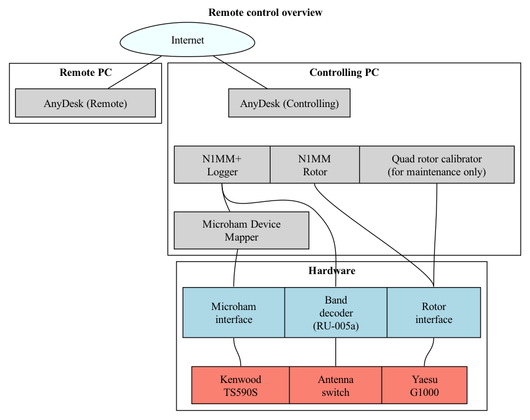

# RK5D remote control (Kenwood working place)
   
## 1. Starting the station: kenwood
1. Start the hardware: for now it's done by Dima manually (Controlling PC, 12V PS, G1000, Microham interface, RU005a band decoder)
2. Connect to the controlling PC in AnyDesk
3. Start the software (there are icons on the Desktop, adding paths just FYI):
- **Microham USB Device Router** (*C:\Program Files (x86)\microHAM\bin\urouter.exe*)
- **N1MM+ Logger** (*C:\Program Files (x86)\N1MM Logger+\N1MMLogger.net.exe*)
- **N1MM Rotor** will be started with the logger automatically
4. Start the transceiver by clicking the **ON** button in N1MM's bandmap window. Before clicking the "ON" button, click the large red "Reset radio" button if it is present.

If everything is ok, you should
- See the transceiver frequency in the bandmap window
- See the current antenna position in the rotor window
- Hear the band noise

Congrats You're ready! Please don't give up and read the following sections carefully in order not to harm the station.

## 2. Controlling the station: kenwood
**ANTENNA SWITCHING**: Antennas are switched automatically when you change the band, however there are some important notes:
- At this working place RU005a band decoder is controlled from PC's LPT port. There is one problem - unsolved for now - there looks to be some port initialization delay or power saving in Windows.
If you face something similar, please use the hack described below: 
    - Antennas are not switched with the band change (you can't hear the band noise)
    - Antenna is switched - so that you hear the band noise for a few seconds - and then gets disconnected right away
    
**LPT port and antenna switching hack:**
Just continue switching bands periodically - say each 5 seconds - for a while - 10 swithes should be enough - until it stops disconnecting the antenna after the band change.
If that does not help, try restarting the band decoder (offline action is required for now).

Common things are described in the [base manual](../README.md).

## 3. Software responsibilities: kenwood

### Overview
Remote user connects to the controlling PC via free AnyDesk software - which provides full remote desktop control and sound streaming. Sound quality may be question for improvement, however current setup (namely an optical connection at the controlling - i.e. shack - side, and a GPON + WiFi at the client side) normally provide an acceptable connection speed for usage in both CW and SSB, given recorded messages are played back at the controlled PC for SSB. There was no need for connecting a remote microphone for us, however that's a point for further investigation.

Using the remote desktop approach instead of configuring each piece of software for network access provides more flexibility - as all the controlling software is used local mode, no limitations caused by usage over network are applied and all the network configuration changes - if any - have to be applied just to AnyDesk configuration rather than to all software as it would have been should we configure each application for remote usage individually. Moreover, any software not supporting network control may be used.

## 4. Hardware connections: kenwood
More detailed connections diagram 

## 5. Detailed setup
See [SETUP.md](SETUP.md)