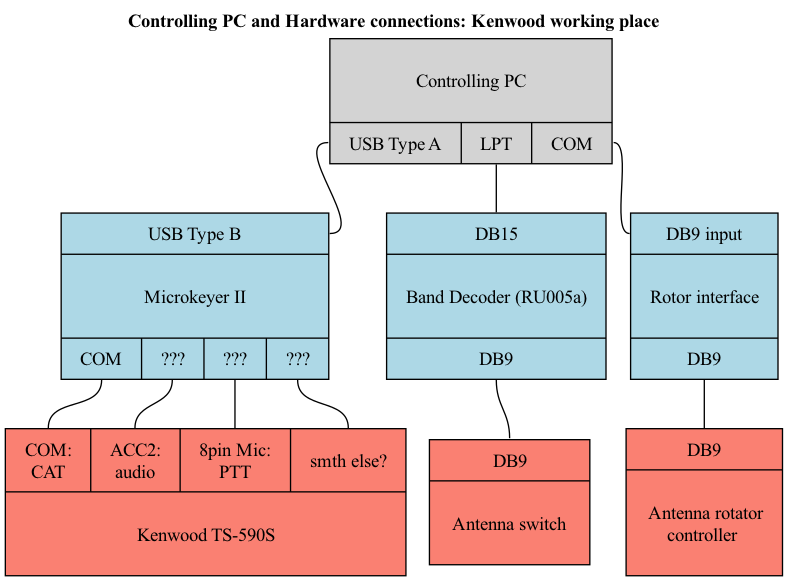
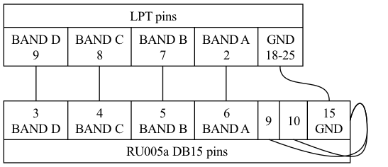

# RK5D remote control configuration (Elecraft)

## Wiring diagram

### PC and RU005a:
- LPT to DB15 cable, pinout:

Shorts between pins 9,10,15 define RU005a "Band data" mode

Pins 18-25 on the LPT side are shorted